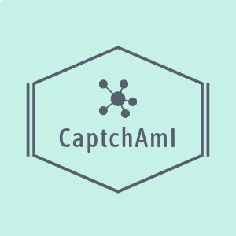

Latest version: 1.0.0 **BETA**


# CaptchAmI - Stars and Numbers Captcha Solver

## What is StarNum Captcha Solver
I made this project to show how it is possible to use AI + Computer Vision to solve Captcha. 
In particular, I had to deal with two captcha types: stars and numbers.
About the image containing the stars, I had to count them; for that containing numbers, I had to perform an operation (addition or subtraction).


The expected output of both the elaboration is a result number, which is: the total of stars printed on the image, or the result of the operation described before.


## Computer Vision elaboration
### Stars elaboration
To recognize how many stars are present, the image is preprocessed: it is initially converted to gray, then colors are inverted and finally a threshold is found.
Everything below this threshold is deleted (usually the background), while the rest of the image is kept intact. 
After that, it is found how many stars are in the image by calculating the number of objects.

### Number elaboration
When there are numbers on the image, the process is different because I have to perform an operation (addition or subtraction).
For this reason I decided to split the images into three parts and process them accordingly using a neural network.
The image elaboration starts in the same way as the previous step, by removing the background and cleaning the image by any possible disturb.
After that, I look for three different regions of pixels (ideally it should be two numbers and one operator).
Occasionally the operator is connected to the same region of one of the numbers, so if it happens I have decided to "manually" split the biggest area to 5px starting from the rightmost limit.
This ensures to have a "usable" operator without cutting too much the operand.

## The Neural Network Part
I created two different neural networks to classify the two different type of input.
As I wanted the program to be able to separate at the same time both the stars from the numbers and elaborate those in order to get the operation result, there are two neural networks:

1) A NN separates the stars from the numbers

2) Another NN recognizes the numbers and the operators

All the NNs expect to work on 136x47 8-bit color png images, they have the same structure, with two convolutional layers and three linear layers. 
The only difference between them is the number of linear units for the classification of the stars and the numbers/operator.
The details of the NN are in the neural_net.py file.

## WebService
This version of CaptchAmI is totally based on a microservice that is used for both the classification and the training.
There are a bunch of endpoints that can be reached by lunching the server:
```
/classify [POST]
```
It accepts a JSON with the image encoded with a field called "base64_img" in witch there is the image encoded with BASE64
It will return the number of stars or the result of the operation. 

```
/retrain/binary [GET]
```
Once called, the neural network that is used to discriminate the image with numbers from the one with the stars is re-trained.
It will return the accuracy of the network on the test set.


```
/retrain/numbers [GET]
```
Once called, the neural network specialized to recognize the numbers and the operational sign is re-trained.
It will return the accuracy of the network on the test set.


## Configuration
To be able to correctly use the CaptchAmI server, you have to modify (if needed) the `config.yaml` file in the root folder of this project.
This file contains all the paths used in the project and eventually need to be replaced according to your needs.
Please refer to the description of the yaml directly into the file


## Conclusions
I just put down some notes.

* The program is still under development and will be tested in the future

* I will create soon a docker image as well

* The dataset I used is in the "dataset" folder

* The accuracy on the test set is around 1. It works pretty well :)